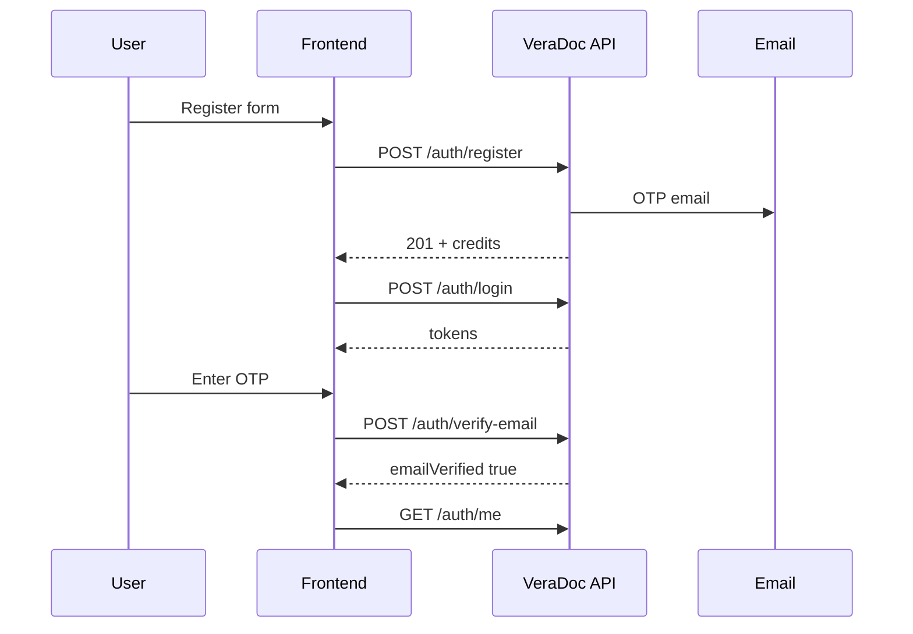
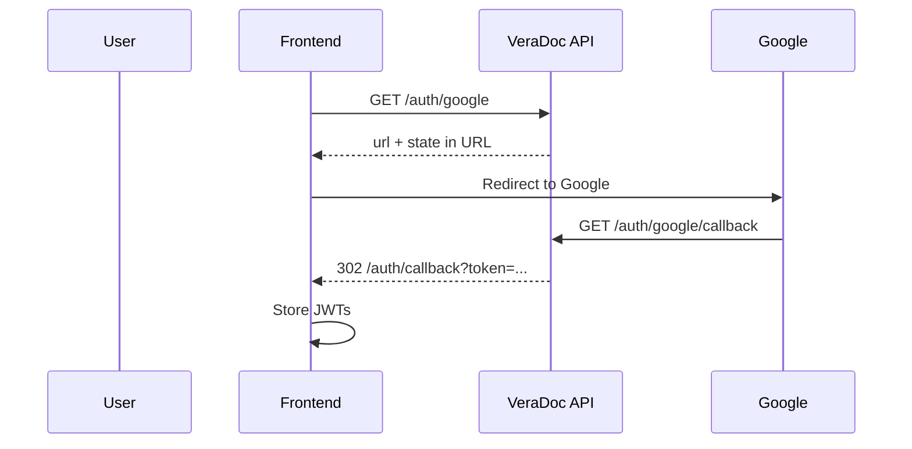

# VeraDoc — Authentication API

**Backend:** FastAPI + PostgreSQL (not MongoDB)  
**Base path:** `/api/auth`  
**Related:** Account settings at `/api/user` · Full product API in `docs/FRONTEND_API.md`

All protected routes use:

```http
Authorization: Bearer <access_token>
```

Errors use FastAPI shape: `{ "detail": "..." }` (string or validation object).

---

## Overview

| Feature | Endpoints |
|---------|-----------|
| Email/password signup & login | `POST /register`, `POST /login` |
| JWT session | `POST /refresh`, `GET /me` |
| Google sign-in | `GET /google`, `GET /google/callback` |
| Email verification (OTP) | `POST /verify-email`, `POST /resend-otp` |
| Forgot / reset password (OTP) | `POST /forgot-password`, `POST /reset-password` |
| Change password (logged in) | `PUT /api/user/password` |
| Delete account | `DELETE /api/user` |

### Signup credits

New users receive **3 credits** by default (`users.credits`).

### Email verification gate

These actions require **`emailVerified: true`** (dependency `get_verified_user`):

- `POST /api/verify/initiate` (document verification)
- `POST /api/credits/purchase/initiate` (buy credits)

Login and `GET /me` work while unverified so the app can show a “verify your email” screen.

---

## Database (PostgreSQL)

### `users`

| Column | Type | Notes |
|--------|------|--------|
| `id` | UUID | Primary key |
| `name` | string | |
| `organisation` | string | |
| `email` | string | Unique |
| `password_hash` | string, nullable | `null` for Google-only accounts |
| `google_id` | string, nullable | Unique; set after Google login |
| `email_verified` | boolean | Default `false`; `true` after OTP or Google login |
| `credits` | int | Default `3` |
| `created_at` | timestamptz | |

### `otp_codes`

One active OTP per **email + type** (unique constraint).

| Column | Type | Notes |
|--------|------|--------|
| `id` | UUID | |
| `user_id` | UUID, nullable | FK → `users` |
| `email` | string | |
| `otp_type` | enum | `email_verification` \| `password_reset` |
| `code_hash` | string | HMAC-SHA256 of 6-digit code (not stored in plain text) |
| `expires_at` | timestamptz | Default TTL **10 minutes** |
| `failed_attempts` | int | Max **5** wrong guesses before OTP is invalidated |
| `created_at` | timestamptz | |

Migrations: `0004_google_auth_otp_email_verified`, `0005_security_hardening`.

---

## Environment variables

```env
# JWT (required)
JWT_SECRET=...
JWT_ACCESS_TOKEN_EXPIRES_MINUTES=30
JWT_REFRESH_TOKEN_EXPIRES_DAYS=30

# Frontend (OAuth redirect after Google)
FRONTEND_URL=https://veradoc.vercel.app

# Google OAuth
GOOGLE_CLIENT_ID=....apps.googleusercontent.com
GOOGLE_CLIENT_SECRET=GOCSPX-...
GOOGLE_REDIRECT_URI=https://your-api.onrender.com/api/auth/google/callback

# Email — SMTP (Gmail example)
EMAIL_DRIVER=smtp
SMTP_HOST=smtp.gmail.com
SMTP_PORT=587
SMTP_TLS=true
SMTP_USER=you@gmail.com
SMTP_PASSWORD=16-char-google-app-password
SMTP_FROM=you@gmail.com

# Email — alternative
# EMAIL_DRIVER=resend
# RESEND_API_KEY=re_...
# RESEND_FROM=noreply@veradoc.app

# OTP tuning
OTP_TTL_MINUTES=10
OTP_RESEND_COOLDOWN_SECONDS=60
OTP_MAX_ATTEMPTS=5
```

### Gmail app password (quick)

1. Google Account → Security → **2-Step Verification** ON  
2. [App passwords](https://myaccount.google.com/apppasswords) → Mail → generate  
3. Use the 16-character password (no spaces) as `SMTP_PASSWORD`

### Google Cloud Console

- Application type: **Web application**
- **Authorized redirect URI:** same as `GOOGLE_REDIRECT_URI` (API URL, not frontend)
- Optional JS origins: `https://veradoc.vercel.app`, `http://localhost:3000`

---

## JWT tokens

| Token | `type` claim | Default lifetime | Use |
|-------|----------------|------------------|-----|
| Access | `access` | 30 min | `Authorization: Bearer` on API calls |
| Refresh | `refresh` | 30 days | `POST /api/auth/refresh?refresh_token=...` |

Refresh issues a **new** access + refresh pair (old refresh tokens are not revoked server-side yet).

---

## Endpoints

### Register

`POST /api/auth/register` · **Auth:** none

**Body:**

```json
{
  "name": "Ada Lovelace",
  "organisation": "Example Ltd",
  "email": "ada@example.com",
  "password": "securepass123"
}
```

**201:**

```json
{
  "message": "Account created successfully. Check your email for a verification code.",
  "credits": 3
}
```

- Sends a **6-digit OTP** email in the background (`email_verification`).
- User is **not** verified until `POST /verify-email`.

**Errors:** `409` — email already registered

---

### Login

`POST /api/auth/login` · **Auth:** none

**Body:**

```json
{
  "email": "ada@example.com",
  "password": "securepass123"
}
```

**200 (`TokenOut`):**

```json
{
  "access_token": "...",
  "refresh_token": "...",
  "token_type": "bearer"
}
```

**Errors:** `401` — invalid credentials (includes Google-only accounts with no password)

---

### Refresh

`POST /api/auth/refresh?refresh_token=<refresh_token>` · **Auth:** none

**200:** New `TokenOut` (same shape as login).

**Errors:** `401` — invalid or expired refresh token

---

### Current user

`GET /api/auth/me` · **Auth:** Bearer

**200 (`MeOut`):**

```json
{
  "id": "uuid",
  "name": "Ada Lovelace",
  "organisation": "Example Ltd",
  "email": "ada@example.com",
  "credits": 3,
  "emailVerified": false
}
```

---

## Google OAuth

### Start Google login

`GET /api/auth/google` · **Auth:** none

**200:**

```json
{
  "url": "https://accounts.google.com/o/oauth2/v2/auth?..."
}
```

- Includes a signed **`state`** parameter (CSRF protection, 10-minute JWT).
- Frontend should redirect the browser to `url` (full page navigation).

### Callback (browser / Google only)

`GET /api/auth/google/callback?code=...&state=...` · **Auth:** none

- Exchanges `code` with Google, loads user profile.
- Requires Google’s `email_verified` flag.
- **Account rules:**
  - Match by `google_id` first.
  - Same email + **unverified** password account → **409** (prevents takeover).
  - Same email + **verified** password account → links `google_id`, sets `emailVerified: true`.
  - New user → creates account (`password_hash` null, `emailVerified: true`, **3 credits**).
- **302 redirect** to:

```text
{FRONTEND_URL}/auth/callback?token=<access_token>&refresh_token=<refresh_token>
```

Frontend must read query params, store tokens, then clear the URL.

**Errors:** `400` invalid state / Google failure · `409` email conflict · `503` OAuth not configured

---

## Email verification (OTP)

### Verify email

`POST /api/auth/verify-email` · **Auth:** Bearer

**Body:**

```json
{
  "otp": "123456"
}
```

**200:**

```json
{
  "message": "Email verified successfully"
}
```

**Errors:**

| Status | Reason |
|--------|--------|
| `400` | Invalid or expired OTP |
| `429` | Too many failed attempts (request new code via resend) |

### Resend verification OTP

`POST /api/auth/resend-otp` · **Auth:** Bearer

**Body:** none

**200:**

```json
{
  "message": "OTP sent successfully"
}
```

**Errors:**

| Status | Reason |
|--------|--------|
| `429` | Cooldown not elapsed (`OTP_RESEND_COOLDOWN_SECONDS`, default 60s) |

---

## Forgot password (OTP)

### Request reset code

`POST /api/auth/forgot-password` · **Auth:** none

**Body:**

```json
{
  "email": "ada@example.com"
}
```

**200:**

```json
{
  "message": "If an account exists, a reset code has been sent"
}
```

**404:** No account with that email (product choice for clearer UX).

**429:** Resend cooldown active.

Email subject: **“Reset your VeraDoc password”** with 6-digit code (10-minute expiry).

### Reset password

`POST /api/auth/reset-password` · **Auth:** none

**Body:**

```json
{
  "email": "ada@example.com",
  "otp": "123456",
  "newPassword": "newsecurepass123"
}
```

**200:**

```json
{
  "message": "Password reset successfully"
}
```

**Errors:** `400` invalid OTP · `404` user not found · `422` password &lt; 8 chars · `429` too many OTP attempts

Google-only users can use this flow to **set a password** for the first time.

---

## Account settings (`/api/user`)

### Change password

`PUT /api/user/password` · **Auth:** Bearer

**Body:**

```json
{
  "currentPassword": "oldpass",
  "newPassword": "newpass123"
}
```

**200:** `{ "message": "Password updated successfully" }`

**400:** Google-only account (no password yet — use forgot-password to set one).

### Delete account

`DELETE /api/user` · **Auth:** Bearer

**200:** `{ "message": "Account deleted" }`

---

## User journeys (frontend)

### A) Email signup



### B) Google signup / login



### C) Forgot password

1. `POST /auth/forgot-password` with email  
2. User enters OTP from email  
3. `POST /auth/reset-password` with email, otp, newPassword  
4. `POST /auth/login` with new password  

---

## OTP email content

Both email types include:

- VeraDoc branding  
- Prominent **6-digit code**  
- “Expires in 10 minutes” notice  

| Type | Subject |
|------|---------|
| `email_verification` | Your VeraDoc verification code |
| `password_reset` | Reset your VeraDoc password |

---

## Security behaviour (implemented)

| Control | Behaviour |
|---------|-----------|
| Password storage | bcrypt (12 rounds) |
| OTP storage | HMAC-SHA256 with server secret; not plain text |
| OTP attempts | Max 5 wrong guesses per code |
| OTP resend | 60s cooldown per email + type |
| Google linking | Blocks linking to unverified password signups |
| Google OAuth | `state` JWT validated on callback |
| Paid actions | Require `emailVerified` |
| Production errors | 500 responses omit internal `detail` unless `ENV=local` |

**Not yet implemented:** refresh-token revocation on password reset, login rate limits (Redis URL exists but unused), moving OAuth tokens out of query strings.

---

## Quick test checklist

| Step | Request |
|------|---------|
| Register | `POST /api/auth/register` |
| Login | `POST /api/auth/login` |
| Me | `GET /api/auth/me` |
| Verify | `POST /api/auth/verify-email` `{ "otp": "......" }` |
| Resend | `POST /api/auth/resend-otp` |
| Google URL | `GET /api/auth/google` → open `url` |
| Forgot | `POST /api/auth/forgot-password` |
| Reset | `POST /api/auth/reset-password` |
| Refresh | `POST /api/auth/refresh?refresh_token=...` |

---

## Deploy checklist

1. `alembic upgrade head` (includes auth + OTP tables)  
2. Set all env vars on Render (JWT, Google, SMTP, `FRONTEND_URL`)  
3. Google Console redirect URI = `GOOGLE_REDIRECT_URI`  
4. Do not commit `.env` or Google client JSON to git  
